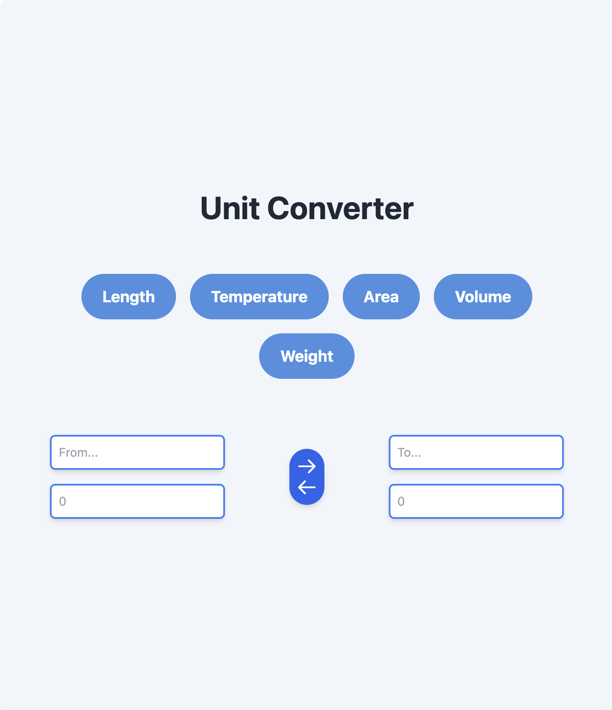
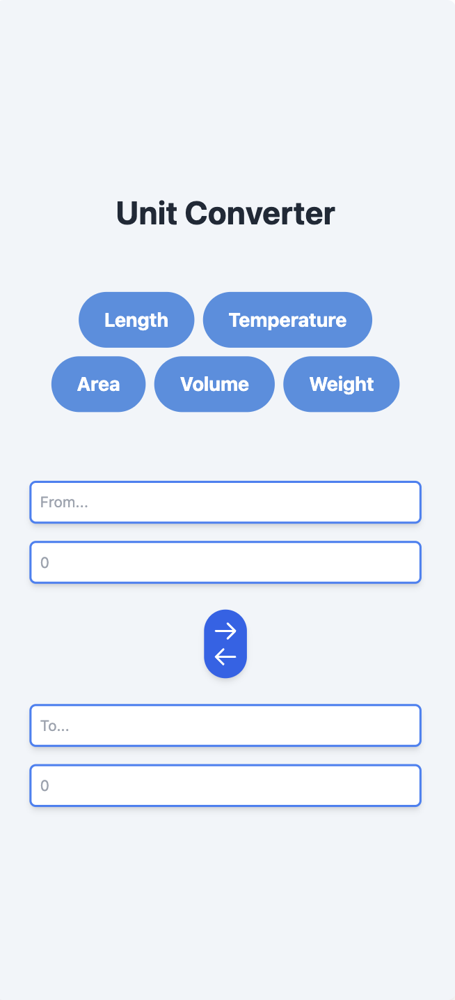

# Unit Converter

A simple and responsive unit converter application built with Vue.js and Tailwind CSS. This application allows users to convert units of length, temperature, area, volume, and weight.

## Features

- Convert units of length, temperature, area, volume, and weight.

## Technologies Used

- Vue.js
- Tailwind CSS

## Screenshots

### Desktop View


### Mobile View


## Installation

```bash
   git clone https://github.com/yourusername/unit-converter.git
   cd unit-converter
   npm install
   npm run dev